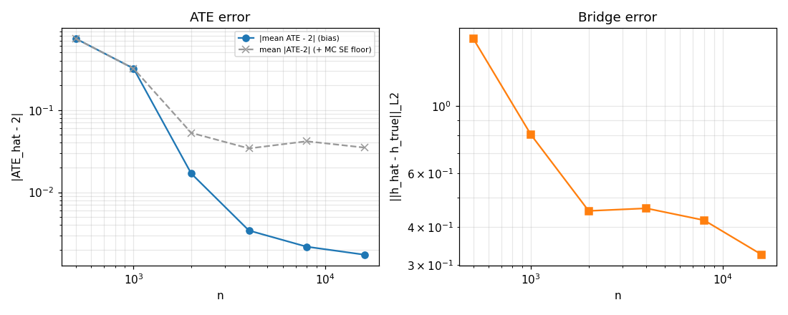

# E1 — Consistency and rates (DGP 3.1)

**Overall: PASS**  (5/5 acceptance criteria met)

## Acceptance criteria

- ✅ PASS — **|ATE-2| bias monotone decreasing (Spearman<-0.9)**: Spearman(n, |mean ATE-2|) = -1.000 (seed-mean-of-|err| Spearman = -0.829, noise-floored at large n)
- ✅ PASS — **||h_hat-h_true||_L2 monotone decreasing (Spearman<-0.9)**: Spearman(n, mean h_L2) = -0.943
- ✅ PASS — **|ATE-2| < 0.10 at n=8000 (mean over seeds)**: mean|ATE-2|@8000 = 0.0417
- ✅ PASS — **h linear-probe R^2 > 0.95 at n=8000**: mean R^2@8000 = 0.9736
- ✅ PASS — **CI95 coverage in [0.85, 0.99] (n>=2000 pooled)**: coverage = 0.875

## Per-n summary (mean over seeds)

|          n |   ate_err |   ate_bias |   h_l2 |   h_r2 |   cover |
|-----------:|----------:|-----------:|-------:|-------:|--------:|
|   500.0000 |    0.7380 |     0.7380 | 1.6691 | 0.9278 |  0.0000 |
|  1000.0000 |    0.3197 |     0.3197 | 0.8052 | 0.9543 |  0.2000 |
|  2000.0000 |    0.0528 |     0.0169 | 0.4519 | 0.9672 |  1.0000 |
|  4000.0000 |    0.0341 |     0.0034 | 0.4608 | 0.9684 |  1.0000 |
|  8000.0000 |    0.0417 |     0.0022 | 0.4210 | 0.9736 |  0.8000 |
| 16000.0000 |    0.0349 |     0.0017 | 0.3242 | 0.9839 |  0.7000 |

Curves: log-log |ATE-2| and bridge L2 error vs n.
