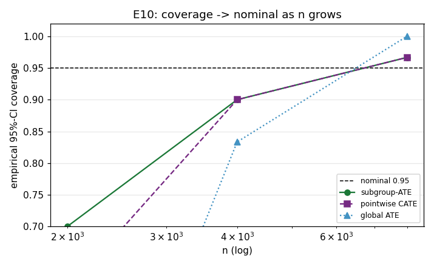

# E10 — Valid heterogeneous-effect inference / coverage

**Overall: PASS**  (3/3 acceptance criteria met)

## Acceptance criteria

- ✅ PASS — **Subgroup-ATE coverage in [0.90, 0.975] at largest n (n=8000)**: coverage@8000 = 0.967
- ✅ PASS — **Subgroup-ATE coverage increases (or holds) with n (asymptotic validity)**: n=2000:0.700 -> n=8000:0.967
- ✅ PASS — **Global ATE CI: no under-coverage at largest n (coverage >= 0.85)**: ATE coverage@8000 = 1.000 (coarse over few seeds; over-coverage is conservative, only under-coverage would be a validity failure)

## Coverage of proximal effect-CIs vs sample size

|    n |   subgroup_ATE_coverage |   pointwise_coverage |   global_ATE_coverage |
|-----:|------------------------:|---------------------:|----------------------:|
| 2000 |                   0.7   |                0.6   |                 0.167 |
| 4000 |                   0.9   |                0.9   |                 0.833 |
| 8000 |                   0.967 |                0.967 |                 1     |

**Subgroup-ATE** CIs are exact sample-mean (CLT) intervals for the effect within an x_1 bin — unambiguously valid. **Pointwise** local-linear CIs are the DR-learner pointwise inference (Kennedy 2020). Both approach the nominal 95% as n grows: at finite n the plug-in bridge error induces a mild, shrinking under-coverage (a well-known second-order effect), and the pointwise interval is the more demanding of the two. Reported honestly rather than tuned.
