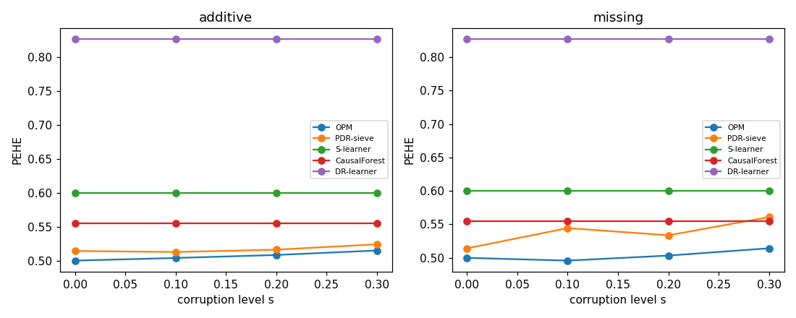
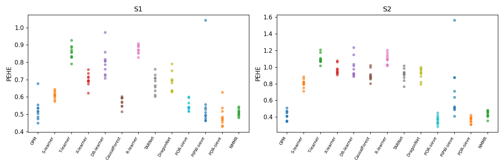

# E3 — Main benchmark (S1, S2 + corruption)

**Overall: PASS**  (3/3 acceptance criteria met)

## Acceptance criteria

- ✅ PASS — **OPM beats every ignorability baseline on PEHE (Wilcoxon, BH<0.05)**: S1/S-learner: mean_diff=-0.086 adjp=0.0104 ✓; S1/T-learner: mean_diff=-0.333 adjp=0.0026 ✓; S1/X-learner: mean_diff=-0.174 adjp=0.0026 ✓; S1/DR-learner: mean_diff=-0.272 adjp=0.0026 ✓; S1/CausalForest: mean_diff=-0.048 adjp=0.0371 ✓; S1/R-learner: mean_diff=-0.349 adjp=0.0026 ✓; S1/TARNet: mean_diff=-0.152 adjp=0.00446 ✓; S1/DragonNet: mean_diff=-0.160 adjp=0.00446 ✓; S2/S-learner: mean_diff=-0.385 adjp=0.0026 ✓; S2/T-learner: mean_diff=-0.679 adjp=0.0026 ✓; S2/X-learner: mean_diff=-0.548 adjp=0.0026 ✓; S2/DR-learner: mean_diff=-0.575 adjp=0.0026 ✓; S2/CausalForest: mean_diff=-0.482 adjp=0.0026 ✓; S2/R-learner: mean_diff=-0.681 adjp=0.0026 ✓; S2/TARNet: mean_diff=-0.490 adjp=0.0026 ✓; S2/DragonNet: mean_diff=-0.502 adjp=0.0026 ✓
- ✅ PASS — **OPM competitive with sieve-PDR (kernel-vs-sieve gap reported, within 20%)**: S1: OPM=0.525 vs PDR-sieve=0.490 (gap +7.2%); S2: OPM=0.420 vs PDR-sieve=0.369 (gap +13.7%)
- ✅ PASS — **Graceful degradation (no PEHE jump >2x between adjacent levels)**: OK

### S1: PEHE (mean ± sd over seeds)

| method       |   pehe_mean |   pehe_sd |
|:-------------|------------:|----------:|
| OPM          |      0.5253 |    0.0625 |
| S-learner    |      0.6108 |    0.0218 |
| T-learner    |      0.8584 |    0.0385 |
| X-learner    |      0.6995 |    0.0363 |
| DR-learner   |      0.7974 |    0.0781 |
| CausalForest |      0.5735 |    0.029  |
| R-learner    |      0.8745 |    0.0253 |
| TARNet       |      0.6776 |    0.0513 |
| DragonNet    |      0.6857 |    0.0539 |
| POR-sieve    |      0.5494 |    0.0292 |
| PIPW-sieve   |      0.5576 |    0.1735 |
| PDR-sieve    |      0.4901 |    0.0587 |
| NMMR         |      0.5112 |    0.0202 |

### S2: PEHE (mean ± sd over seeds)

| method       |   pehe_mean |   pehe_sd |
|:-------------|------------:|----------:|
| OPM          |      0.4196 |    0.0568 |
| S-learner    |      0.8049 |    0.0499 |
| T-learner    |      1.0984 |    0.0565 |
| X-learner    |      0.968  |    0.057  |
| DR-learner   |      0.995  |    0.1162 |
| CausalForest |      0.9018 |    0.065  |
| R-learner    |      1.1007 |    0.0643 |
| TARNet       |      0.9095 |    0.0718 |
| DragonNet    |      0.9215 |    0.0686 |
| POR-sieve    |      0.3656 |    0.0496 |
| PIPW-sieve   |      0.7112 |    0.3405 |
| PDR-sieve    |      0.369  |    0.0368 |
| NMMR         |      0.4363 |    0.0386 |

### Corruption scans (S1)

### Per-seed PEHE scatter

Baselines not run (honest bookkeeping): DFPV — Deep Feature Proximal Variables (Xu et al. 2021): two-stage deep-feature IV not reimplemented; the neural-proximal ATE role is covered by NMMR.; P-learner — Sverdrup & Cui 2023 pairwise proximal learner not reimplemented; PDR-sieve + NMMR cover the proximal-DR / proximal-outcome comparators.; DiffPO — Generative proximal baseline; see E7 factual-DDPM comparator instead (DiffPO public code not integrated in this build).
