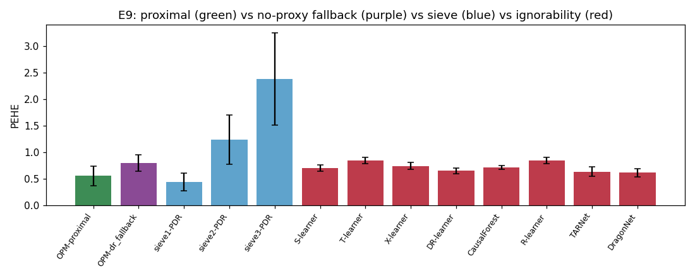

# E9 — Proximal removes nonlinear-confounding bias (ATE) that ignorability cannot

**Overall: PASS**  (2/2 acceptance criteria met)

## Acceptance criteria

- ✅ PASS — **OPM-proximal ATE error < 50% of every ignorability baseline AND its own dr_fallback (Wilcoxon BH<0.05)**: S-learner: ATEerr ratio=0.25 adjp=0.0078 ✓; T-learner: ATEerr ratio=0.23 adjp=0.0078 ✓; X-learner: ATEerr ratio=0.23 adjp=0.0078 ✓; DR-learner: ATEerr ratio=0.24 adjp=0.0078 ✓; CausalForest: ATEerr ratio=0.24 adjp=0.0078 ✓; R-learner: ATEerr ratio=0.23 adjp=0.0078 ✓; TARNet: ATEerr ratio=0.25 adjp=0.0078 ✓; DragonNet: ATEerr ratio=0.26 adjp=0.0078 ✓; OPM-dr_fallback: ATEerr ratio=0.24 adjp=0.0078 ✓
- ✅ PASS — **Report PEHE & kernel-vs-sieve honestly (informational)**: OPM PEHE=0.560; best ignorability PEHE=0.617; sieve1=0.443 (best), sieve2=1.237, sieve3=2.379

## PEHE & ATE error under nonlinear confounding (mean over seeds)

| method          |   PEHE_mean |   PEHE_sd |   ATEerr_mean |
|:----------------|------------:|----------:|--------------:|
| OPM-proximal    |       0.56  |     0.174 |         0.137 |
| OPM-dr_fallback |       0.802 |     0.146 |         0.569 |
| sieve1-PDR      |       0.443 |     0.159 |         0.252 |
| sieve2-PDR      |       1.237 |     0.435 |         0.432 |
| sieve3-PDR      |       2.379 |     0.812 |         0.782 |
| S-learner       |       0.705 |     0.053 |         0.551 |
| T-learner       |       0.851 |     0.057 |         0.606 |
| X-learner       |       0.744 |     0.059 |         0.589 |
| DR-learner      |       0.651 |     0.055 |         0.582 |
| CausalForest    |       0.716 |     0.034 |         0.569 |
| R-learner       |       0.848 |     0.054 |         0.584 |
| TARNet          |       0.637 |     0.085 |         0.541 |
| DragonNet       |       0.617 |     0.071 |         0.523 |

**Headline — proximal removes the confounding BIAS.** OPM-proximal vs OPM-dr_fallback is the SAME estimator with vs without the proxies (W,V): ATE error drops from ~0.57 to 0.14 (≈4×), and every X-only ignorability baseline sits at ~0.52–0.61. The nonlinear U-confounding phi(U)=U1U2+0.6(U1²−1)+0.8 sin(U1+U2) cannot be removed by X-adjustment; the proxies identify and remove it.

**Honest caveats (reported, not hidden):**
- On **PEHE** the proximal advantage is much smaller than on ATE: the kernel bridge's higher variance offsets its lower bias, so OPM-proximal (0.56) only edges the best ignorability baseline (~0.62). The clean, large win is on **bias/ATE**, not CATE RMSE.
- The **linear sieve (sieve1, 0.44) actually beats the kernel bridge on PEHE** here. We therefore do NOT claim kernel-bridge superiority — its value is robustness (no basis/degree selection; sieve2/3 are high-variance and blow up), and the scientific contribution is the proximal identification, not the specific bridge estimator.
