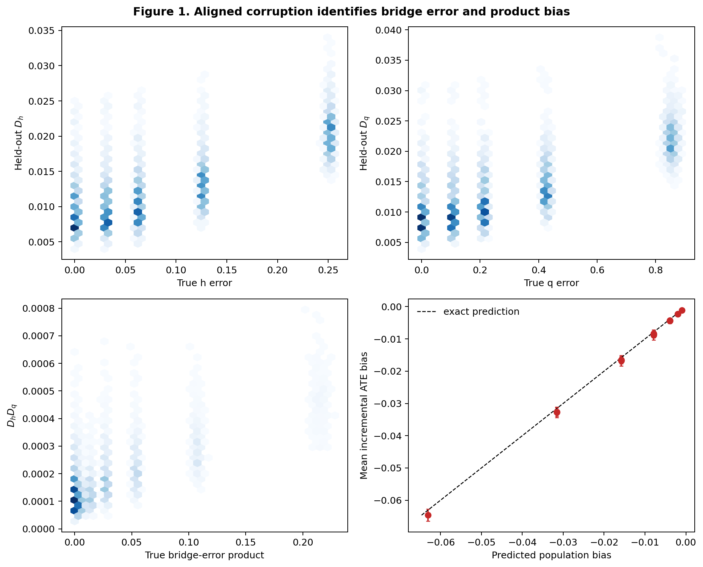
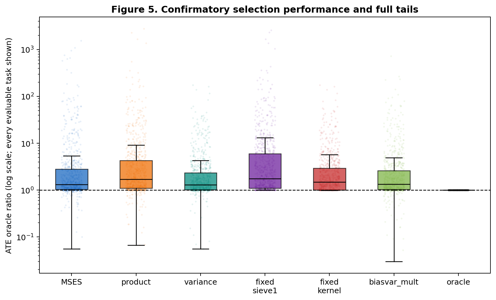
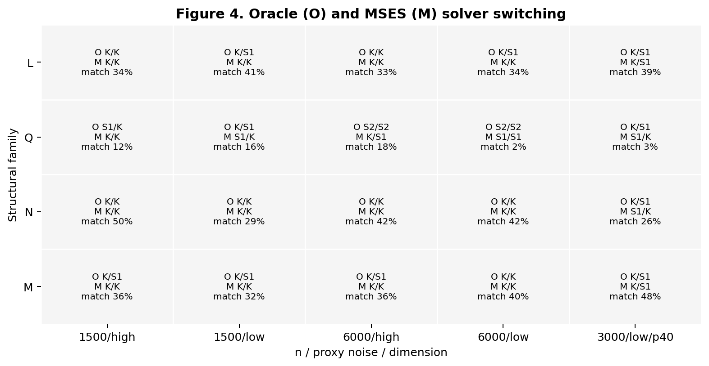
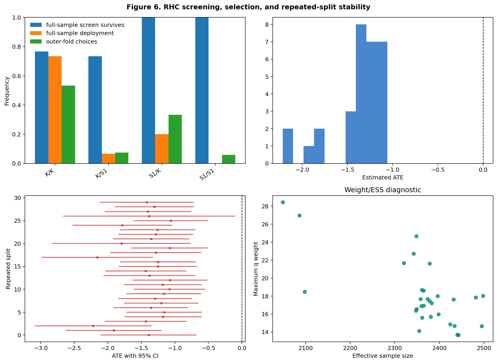

NOT_SUPPORTED

# MV-OPM Round 2 confirmatory report

## Verdict

The corrected mechanism study strongly confirms that held-out proximal identifying moments track
bridge error and, under aligned two-sided corruption, the predicted second-order causal bias.
The solver benchmark also creates a genuine model-selection problem: every registered candidate
is oracle-best on some seeds and oracle winners change with sample size and proxy noise.

The proposed confirmatory method, Moment-Screened Efficiency Selection (MSES), is **not supported
as a reliable near-oracle selector**. Across B2--E2 plus the switching matrix, its median ATE
oracle ratio is 1.325 rather than the preregistered approximately <=1.10, and its catastrophic
rate is 42.2% rather than <=20%. MSES improves typical outcomes relative to the Round-1
moment-only rule, but not the mean or tail: formal screening rejects nearly every oracle candidate
in the nonlinear D2 study and leaves high-variance sieve2/3 candidates available for selection.
Variance-only selection is better overall than MSES. No post-hoc method was substituted and no
final seed was changed.

This verdict applies to the proposed MSES method and its intended paper story. The narrower
bridge-diagnostic result remains strongly supported and may justify a diagnostic or negative-results
paper after reframing.

## Evidence integrity

The final manifest contains 6,820 registered tasks. The deterministic reconstruction found 6,820
successful task rows, 10,020 candidate rows, zero missing rows, and zero failed rows. A resume run
after completion launched zero tasks. The per-study counts are A2 5,000; B2--E2 50 each; R 600;
F2 120; G2 480; H2 240; I2 150; and J2 30. Every scientific, split, bootstrap, and bank seed is
explicit. Final raw results record source checkpoint `aa983a2`; the protected pre-Round-2 commit is
`6122aeb9a145c5835939dc292161e0c5715434bf` on branch `mvopm-round2-confirmatory`.

Primary evidence links:

- [Frozen preregistration](../../docs/mvopm_round2/ROUND2_PREREG.md)
- [Aggregation audit](final/AGGREGATION_AUDIT.json)
- [Machine-readable evidence summary](final/analysis/EVIDENCE_SUMMARY.json)
- [Selector performance](final/analysis/tables/selector_performance.csv)
- [Paired selector comparisons](final/analysis/tables/paired_selector_comparisons.csv)
- [Candidate-level scenario table](final/analysis/tables/candidate_by_scenario.csv)
- [Exact candidate rows, including p_h, p_q, and p_DR arrays](final/raw_candidates.csv)
- [Six confirmatory figures](final/analysis/figures/)
- [Independent methods/statistics review](../../docs/mvopm_round2/reviews/REVIEW_A2_METHODS_POSTRUN.md)
- [Independent engineering/provenance review](../../docs/mvopm_round2/reviews/REVIEW_B2_ENGINEERING_POSTRUN.md)

## Preregistered success criteria

| Criterion | Final evidence | Result |
|---|---:|---|
| MSES pooled median oracle ratio approximately <=1.10 | 1.325 on 793 evaluable core/switching tasks | FAIL |
| Catastrophic selection rate <=0.20 | 0.422 among evaluable tasks; 7 additional abstentions | FAIL |
| Material improvement over fixed kernel | Lower catastrophic rate, but higher mean and median absolute error; only 53.7% paired wins | FAIL |
| Improvement over fixed sieve1 when sieve1 is not oracle | 67.9% row-level paired wins and positive median gain, but mean loss from severe tails; seed-block 95% mean CI is entirely negative | FAIL |
| Oracle candidate survives screening at high frequency | 0.861 pooled, but only 0.115 in D2 | MIXED |
| Genuine oracle switching | All six candidates win; 66.7% of matched n/noise transitions change winner | PASS |
| Corrected product-bias mechanism | Prediction-to-bias slope 1.023 and R2 0.811 | PASS |
| Advantage persists in nonlinear and semi-synthetic settings | D2 fails severely; E2 is favorable but narrowly misses thresholds | FAIL |

Most primary criteria fail; the negative verdict is therefore not a judgment call at the margin.

## A. Mechanism

Study A2 used 25 registered corruption cells with 200 Monte Carlo repetitions per cell. Independent
Gauss-Hermite quadrature fixed `E[tanh(X1)^2]=0.3942944903978411`, yielding the exact prediction
`-r_h*r_q*0.3942944903978411`.

The final data establish the intended mechanism:

- predicted versus incremental ATE bias: Pearson 0.9005, Spearman 0.7565, slope 1.0228,
  intercept -0.00034, R2 0.8108;
- largest absolute single-side cell mean: 0.000812;
- largest absolute both-corrupted cell mean: 0.064636;
- D_h versus true h error: Pearson 0.7203, Spearman 0.6242;
- D_q versus true q error: Pearson 0.7176, Spearman 0.6333;
- moment product versus true bridge-error product: Pearson 0.6757, Spearman 0.5303;
- the minimum q multiplier was about 0.600, and both reference-arm bridges remained unchanged.

This repairs the cancellation defect in Round 1 and supports the claim that the diagnostics carry
information about bridge error and aligned product bias. It does not imply that their finite-sample
p-values reliably order causal estimators.

## B. Fairness

The observed-data convergence audit used four scenarios and eight development seeds per scenario.
Held-out discrepancy continued improving by more than the frozen 5% plateau rule from 180 to 300
epochs, and successive predictions were not within the stability tolerance. No oracle error was
computed or loaded by the audit, so the final kernel budget was correctly frozen at 300 epochs,
patience 45, before final seeds. The CATE head used 300 epochs/patience 30.

Pilot-1's kernel was therefore undertrained by the preregistered observed-data definition. That
undertraining contributed to its near-universal failures, but it did not explain them completely:
with the corrected 300-epoch budget, fixed-kernel catastrophic rates were still 0.28 (B2), 0.44
(C2), 0.58 (D2), and 0.94 (E2), or 0.56 over the four flagship studies. Candidate training was
made fairer; fixed kernel still was not a reliable universal solver.

## C. Selection

The primary comparison pools the 200 flagship tasks and 600 switching tasks. Seven D2 tasks
abstained, leaving 793 evaluable MSES estimates.

| Selector | Median oracle ratio | Mean ATE error | Median ATE error | Catastrophic rate |
|---|---:|---:|---:|---:|
| MSES | 1.325 | 0.1874 | 0.0553 | 0.422 |
| Product moment | 1.697 | 0.1185 | 0.0791 | 0.553 |
| Variance only | 1.300 | 0.0818 | 0.0518 | 0.394 |
| Fixed sieve1 | 1.750 | 0.1287 | 0.0874 | 0.568 |
| Fixed kernel | 1.476 | 0.1024 | 0.0539 | 0.494 |

MSES improves typical performance over moment-only selection: paired median error reduction is
0.00244, it has lower error on 55.4% of paired tasks, and its catastrophic rate is 13 percentage
points lower. But the paired mean reduction is **negative** (-0.0688; study-stratified
scientific-seed-block bootstrap 95% CI [-0.1085,-0.0344]) because its nonlinear failures are much
larger. The interval resamples 223 evaluable scientific-seed blocks and keeps all 20 registered R
regimes together within a sampled seed. Thus MSES does not robustly outperform moment-only
selection; row-level medians and win fractions above are descriptive rather than independent-row
inference.

Formal screening also fails to improve on variance-only selection: MSES has larger mean and median
error, a higher catastrophic rate, and lower error on only 23.3% of paired tasks. The data do not
support the claim that the prespecified moment screen adds reliable selection value to the
efficiency criterion.

The decisive failure is D2. MSES abstains on 7/50 seeds; among the remaining 43, median oracle
ratio is 52.66 and 40/43 are catastrophic. Twenty-six D2 estimates have absolute ATE error above
one, reaching 11.32. In those rows the formal screen often rejects all lower-risk/oracle candidates
and retains sieve2/3 in one or more outer folds. These outcomes are displayed rather than clipped
in Figure 5.

## D. Fixed baseline and oracle switching

The regime benchmark is informative. Across its 600 tasks, all six candidates are oracle-best at
least once: kernel+sieve1 36.0%, kernel+kernel 26.2%, sieve1+sieve1 14.2%, sieve1+kernel 11.7%,
sieve2+sieve2 11.2%, and sieve3+sieve3 0.8%. Every one of the 20 regimes has a non-sieve1 modal
oracle. The winner changes in 70.4% of paired sample-size transitions and 62.9% of paired proxy-noise
transitions.

MSES nevertheless matches the oracle candidate in only 30.6% of outer folds on average. On tasks
where sieve1+sieve1 is not oracle, MSES beats fixed sieve1 on 67.9% of pairs and has a positive
median reduction of 0.0104, but its mean error is worse by 0.0438 because of D2; the stratified
seed-block 95% CI for the mean gain is [-0.0883,-0.0071]. Against fixed kernel it wins only 51.0%
of those rows and again has a worse pooled mean. In R alone, however, MSES lowers mean error versus
fixed kernel by 0.01274 (about 14%; seed-block 95% CI [0.00933,0.01546]) and has lower error on
54.7% of regime rows. The benchmark therefore supports a modest adaptive advantage in its
purpose-built switching matrix, not general near-oracle success.

## E. Robustness

MSES performance is uneven rather than robust:

| Study | Setting | Median oracle ratio | Catastrophic rate | Oracle survival |
|---|---|---:|---:|---:|
| B2 | S1 | 1.234 | 0.22 | 0.800 |
| C2 | S2 multi-treatment | 1.451 | 0.48 | 0.840 |
| D2 | nonlinear E9, evaluable tasks | 52.658 | 0.930 | 0.115 |
| E2 | HAMD semi-synthetic | 1.118 | 0.22 | 0.935 |
| R | L/Q/N/M switching | 1.304 | 0.415 | 0.924 |
| F2 | confounding strength | 1.411 | 0.433 | 0.790 |
| G2 | proxy corruption | 1.464 | 0.481 | 0.848 |
| H2 | n/family scaling | 1.379 | 0.458 | 0.948 |

The proximal estimators themselves retain value under hidden confounding. In F2, ignorability ATE
error grows from 0.113 at c_U=0 to 0.543 at c_U=2, while MSES-selected proximal error ranges from
0.065 to 0.115. That is evidence for proximal adjustment, not for near-oracle selection: at c_U=2,
fixed sieve1 error (0.0815) is materially below MSES (0.1146).

Proxy-corruption and sample-size results do not reveal a stable MSES advantage. Across the 16 G2
cells, MSES catastrophic rates range from 0.333 to 0.633 and are generally no better than the
moment-only or fixed-sieve baselines. H2 catastrophic rates remain 0.367--0.667 across the
registered n values and L/N families rather than vanishing with n.

## F. Catastrophic failure

There are 335 catastrophic MSES estimates among 793 evaluable core/switching tasks (42.2%), plus
seven abstentions. Counting catastrophic selections or abstentions as a non-deployment outcome
gives 342/800 (42.75%). The failures are scientifically concentrated in D2 but the catastrophic
rate also exceeds the preregistered 20% target in B2, C2, E2, and R.

The mechanism is not simply high variance escaping an otherwise correct screen. In D2, the
oracle-candidate outer-fold survival rate is only 11.5%, the mean survivor set is 2.13 candidates,
and retained sieve2/3 candidates dominate catastrophic selected folds. More Monte Carlo power
would estimate this failure rate more precisely; it would not reverse the observed magnitude.

## G. Screening and abstention

Screening is statistically meaningful in a limited falsification sense, but not reliable as a
general adequacy gate:

- pooled core/switching oracle survival is 86.1%, but D2 survival is 11.5%;
- the pooled survivor set still averages 4.62 of six candidates, so screening is often permissive;
- in the deliberately overregularized one-kernel library, MSES abstains on 70% of seeds;
- in the deliberately constrained sieve1-only nonlinear library, it abstains on 0% of seeds;
- in the adequate/easy full library, false abstention is 0%.

The supported claim is narrow: MSES can abstain when a candidate library is detectably incompatible
with the tested moments, as in severe regularization. It did not detect the other registered form
of library inadequacy, and it cannot establish causal proxy validity or completeness.

## H. Real data

On RHC, full-sample OOF deployment decisions select kernel+kernel on 22/30 repeated split seeds
(73.3%), sieve1+kernel on 6/30 (20.0%), and kernel+sieve1 on 2/30 (6.7%); sieve1+sieve1 is never
selected. Every selected bridge pair contains a kernel component. Survival frequencies are 76.7%
for kernel+kernel, 73.3% for kernel+sieve1, and 100% for both sieve1-h candidates.

Those full-sample decisions are distinct from the 120 stored outer-fold choices: kernel+kernel is
chosen in 53.3% of folds, sieve1+kernel in 33.3%, kernel+sieve1 in 7.5%, and sieve1+sieve1 in 5.8%.
Only 42.5% of outer-fold choices match the corresponding split's full-sample deployment choice.
Figure 6 and the candidate-frequency table now display and label both quantities explicitly; the
difference is further evidence of selection instability, not independent replication.

All 30 ATE estimates are negative and all reported 95% CIs exclude zero. The mean ATE is -1.384,
median -1.300, split SD 0.299, and range [-2.217,-1.058]. The effect direction is stable; the
magnitude is not "highly stable" because the range is 1.16 units and the lower-tail splits are
visibly separated. Mean ESS is 2,360 (minimum 2,049), mean maximum q is 18.10 (maximum 28.43), and
mean q-balance error is 0.0175. These are 30 algorithmic splits of one dataset, not 30 independent
datasets, and no causal truth is available.

## I. CATE

The strongest confirmed contribution is **not CATE model selection**. MSES's criterion is the
variance of an ATE influence-function contrast, which is not automatically aligned with PEHE or
conditional risk. Round 2 implemented and unit-tested a pairwise CATE relative-risk functional,
but did not establish the proximal nuisance-rate theorem, conditional unbiasedness, and evaluation
independence needed to promote it, nor deploy it as a confirmatory selector in this matrix.

PEHE remains a secondary candidate diagnostic. The defensible claim is ATE-level selection plus
bridge-error diagnostics, and even the ATE selector failed its confirmatory targets. The detailed
boundary is in [CATE_SELECTION_ANALYSIS.md](../../docs/mvopm_round2/CATE_SELECTION_ANALYSIS.md).

## J. Novelty and strongest defensible contribution

The supported contribution is narrower than the intended MSES paper:

> Held-out proximal identifying moments measure bridge error and aligned second-order causal bias,
> but neither a moment-only score nor the tested formal moment-screen-then-efficiency rule is a
> reliable finite-sample estimator selector. Screening can discard the best candidates in hard
> nonlinear regimes, while variance-blind moment compatibility allows catastrophic flexible
> candidates to survive.

This is a useful model-agnostic diagnostic and negative result. It is distinct from claiming a
first proximal CATE method, a general proxy-validity test, or a successful hidden-confounding CATE
selector. Relative positioning and prohibited novelty claims are documented in
[LITERATURE_BOUNDARY.md](../../docs/mvopm_round2/LITERATURE_BOUNDARY.md).

The most credible next paper direction is therefore a bridge-diagnostic/failure-analysis paper or
a fundamentally redesigned selector. Per protocol, no replacement score should be tuned on these
final seeds. The post-hoc `biasvar_mult` and `biasvar_add` rows remain exploratory Round-1 baselines
and do not alter this verdict.

## Interpretation cautions

The denominator called `oracle_best` is the best fixed candidate in the registered library on that
simulation seed, not an omniscient nested meta-selector. A nested fold-wise selector can therefore
occasionally achieve an oracle ratio below one by mixing candidates. Near-zero oracle errors also
make mean ratios heavy-tailed, so this report emphasizes preregistered medians, absolute error,
paired differences, and catastrophic rates together.

Passing the finite 200-RFF moment test does not prove a bridge restriction, completeness, or proxy
validity. RHC estimates have no oracle labels, and repeated splits measure algorithmic sensitivity
only. These limitations are part of the negative verdict rather than reasons to redefine the
confirmatory target.
